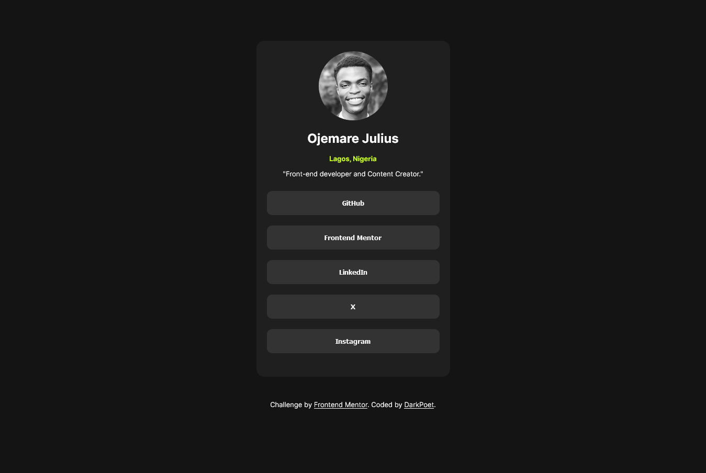

# Frontend Mentor - Social links profile solution

This is a solution to the [Social links profile challenge on Frontend Mentor](https://www.frontendmentor.io/challenges/social-links-profile-UG32l9m6dQ). Frontend Mentor challenges help you improve your coding skills by building realistic projects. 

## Table of contents

- [Overview](#overview)
  - [The challenge](#the-challenge)
  - [Screenshot](#screenshot)
  - [Links](#links)
- [My process](#my-process)
  - [Built with](#built-with)
  - [What I learned](#what-i-learned)
- [Author](#author)

## Overview

### The challenge

Users should be able to:

- See hover and focus states for all interactive elements on the page

### Screenshot

### Links

- Solution URL: [https://github.com/Ojay16/social_links.git]
- Live Site URL: [https://ojay16.github.io/social_links/]

## My Process

### Built with

- Semantic HTML5 markup
- CSS custom properties
- JavaScript
- Flexbox
- Mobile-first workflow

### What I learned
In this project, I learned how to efficiently use JavaScript to set target websites for my buttons, allowing me to write fewer lines of code.

## Author

- Website - [DarkPoet](https://ojay16.github.io/Portfolio/)
- Frontend Mentor - [@Ojay_Of_Esan](https://www.frontendmentor.io/profile/Ojay16)
- Twitter - [@yourusername](https://x.com/Ojay_Of_Esan)